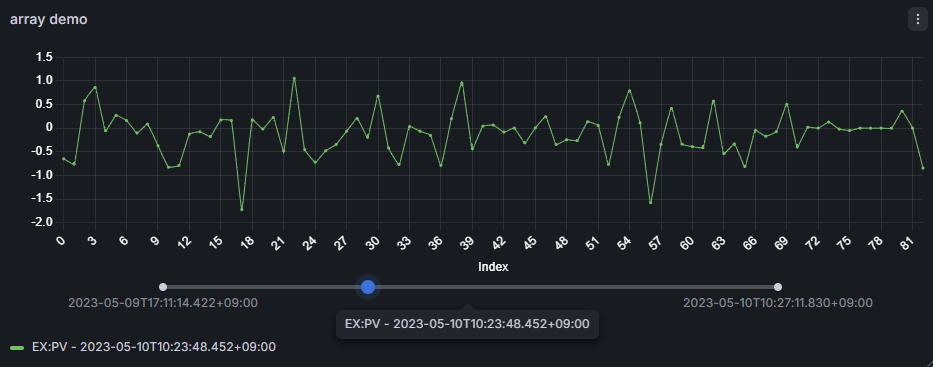

# Waveforms Panel for Grafana

## Overview

Waveforms Panel for Grafana is designed to be used together with the [Archiver Appliance datasource plugin](https://github.com/sasaki77/archiverappliance-datasource).

This panel is optimized for visualizing array data retrieved from Archiver Appliance when an `index` is specified in the `arrayFormat` option of the datasource.

Internally, waveform rendering is implemented using [Chart.js](https://www.chartjs.org/), enabling interactive and efficient visualization of array data.



## Features

- **Time selection with slider**
  Select and display array data at an arbitrary timestamp using a time slider.

- **Interactive zoom with drag and click reset**
  Zoom into a specific range of the waveform by dragging over the display area, and reset the zoom to the full view with a single click.

## Installing the plugin with Grafana CLI

1. Install the plugin with Grafana CLI. Execute Grafana CLI as following:
```bash
# Install latest version. You can also use this command to update the plugin to the latest version.
grafana cli --pluginUrl https://github.com/sasaki77/waveforms-panel/releases/latest/download/sasaki77-waveforms-panel.zip plugins install sasaki77-waveforms-panel

# Install particular version. This example will install v1.0.0.
grafana cli --pluginUrl https://github.com/sasaki77/waveforms-panel/releases/download/v1.0.0/sasaki77-waveforms-panel.zip plugins install sasaki77-waveforms-panel
```
2. This plugin is unsigned. It must be specially listed by name in the Grafana `grafana.ini` file to allow Grafana to use it. Add `sasaki77-waveforms-panel` to the `allow_loading_unsigned_plugins` parameter in the `[plugins]` section. See [Configure Grafana | Grafana documentation](https://grafana.com/docs/grafana/latest/setup-grafana/configure-grafana/) for more detail on `grafana.ini`.

To update the plugin, execute Grafana CLI again.

## Supported data format

This panel expects array data provided as a table-like DataFrame, typically generated by the Archiver Appliance datasource with `arrayFormat` and an `index` specified.

The data format is structured as follows:

- The **rows** represent array indices.
- The **first column** is the array index.
- Each **subsequent column** represents a timestamp.
- Each cell contains the array value at the given index and timestamp.

Example:

| index | 2020-01-01T00:00:10.000Z | 2020-01-01T00:01:50.000Z |
| ----- | ------------------------ | ------------------------ |
| 0     | val1_1                   | val2_1                   |
| 1     | val1_2                   | val2_2                   |
| ...   | ...                      | ...                      |
| 360   | val1_361                 | val2_361                 |

In this representation, each time column corresponds to one waveform, and the index column defines the sample position within the waveform.

⚠️ This panel is optimized for this specific table layout and may not work correctly with generic time series formats.

## Development setup

LTS version of Node.js is recommended. If you're new to the Node.js ecosystem, [Node Version Manager](https://github.com/nvm-sh/nvm) is a good place to start for managing different Node.js installations and environments.

[Grafana's plugin tools](https://grafana.com/developers/plugin-tools/) is used to develop the plugin. Please refer the documentation for more information.


1. Install dependencies
    ```bash
    npm ci
    ```

2. Build plugin in development mode
    ```bash
    npm run dev
    ```

3. Build plugin in production mode
    ```bash
    npm run build
    ```

## Development Environment

[Development Containers](https://containers.dev/) is available for development.
You can launch a development container directly from Visual Studio Code.

The repository also includes a `docker-compose.yaml` file for the test environment.
The compose file currently defines a single container:

- `grafana`

## License

This project is licensed under the Apache License, Version 2.0.

See the [LICENSE](LICENSE) file for details.
